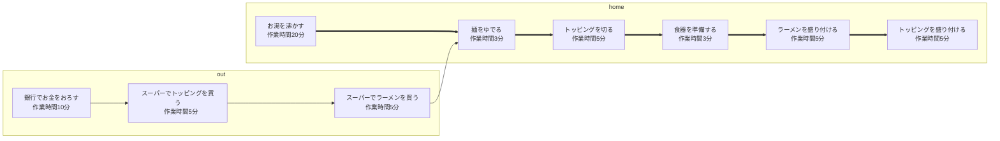

```mermaid

graph LR;

    goto_bank["銀行でお金をおろす
    作業時間10分"]

    goto_super["スーパーでトッピングを買う
    作業時間5分"]

    bay_men["スーパーでラーメンを買う
    作業時間5分"]

    boil_hotwater["お湯を沸かす
    作業時間20分"]

    boil_men["麺をゆでる
    作業時間3分"]

    cut_topping["トッピングを切る
    作業時間5分"]

    junbi["食器を準備する
    作業時間3分"]

    morituke["ラーメンを盛り付ける
    作業時間5分"]

    morituke_topping["トッピングを盛り付ける
    作業時間5分"]


subgraph "out"

 direction LR

 goto_bank--->goto_super--->bay_men;

end


subgraph "home"

 boil_hotwater===>boil_men===>cut_topping===>junbi===>morituke===>morituke_topping;

end


 bay_men-->  boil_men


```