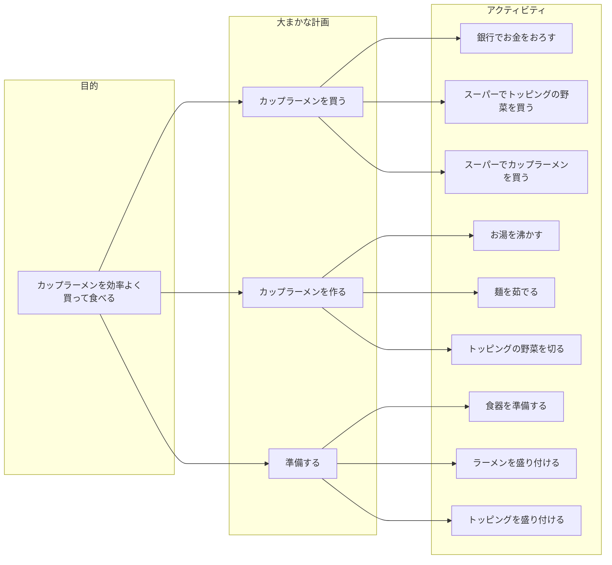

```mermaid

flowchart LR

subgraph 目的

    eat["カップラーメンを効率よく買って食べる"]

end

subgraph 大まかな計画

    bay["カップラーメンを買う"]

    cook["カップラーメンを作る"]

    preparation["準備する"]

end


subgraph アクティビティ

    bank["銀行でお金をおろす"]

    topping["スーパーでトッピングの野菜を買う"]

    super["スーパーでカップラーメンを買う"]


    boil["お湯を沸かす"]

    men["麺を茹でる"]

    cut["トッピングの野菜を切る"]


    motion["食器を準備する"]

    Arra["ラーメンを盛り付ける"]

    Arra_topping["トッピングを盛り付ける"]
    


end


eat--->cook;

eat--->bay;


eat--->preparation;


bay--->bank;
bay--->topping
bay--->super;


cook--->boil;
cook--->men
cook--->cut;


preparation--->motion;

preparation--->Arra;

preparation--->Arra_topping;

 

```