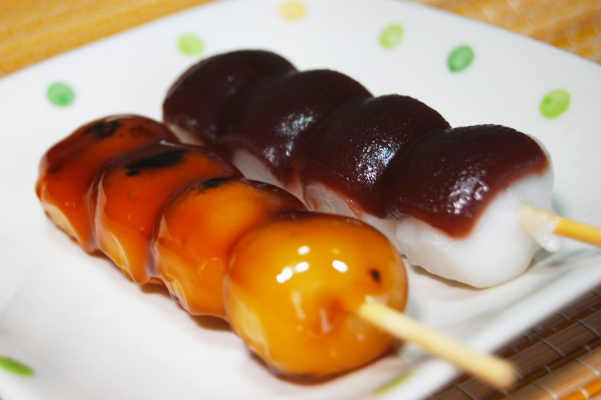
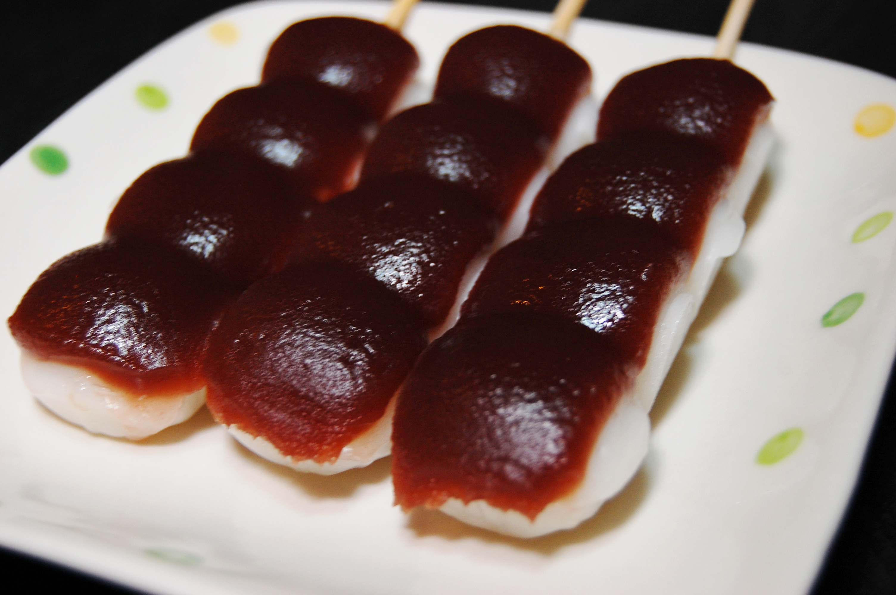
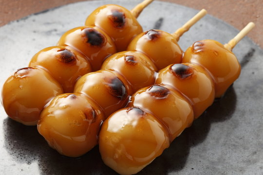
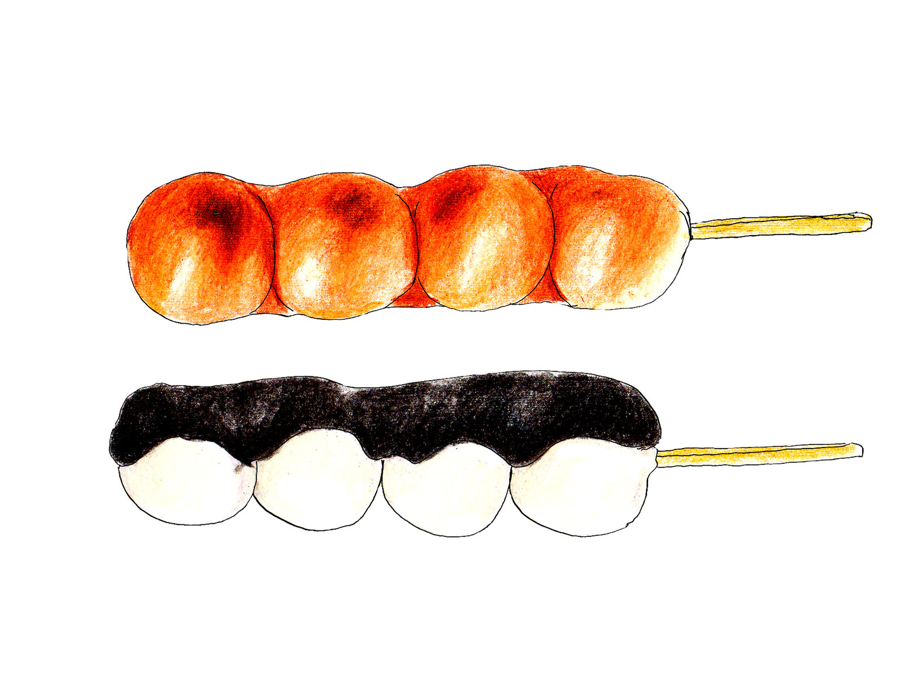

# 私のおすすめの餅

### 串団子

***
>"お団子は素材にこだわっており、毎朝手作りしています。手作りの味わいはどこか昔懐かしく、多くの人に親しまれやすくなっています。また団子は時間が経つと固くなってしまいますが、こちらのお団子は時間が経っても柔らかく、もちもちしているのが特徴です。"

#### 引用元:[串団子の魅力](https://www.dango-yamaka.jp/blog/3277/ "")

#### 大福の種類
- あん団子

- みたらしだんご

- ごま団子

[大福の紹介](../index.md)

[餅の簡単な作り方](../02/02index.md)

