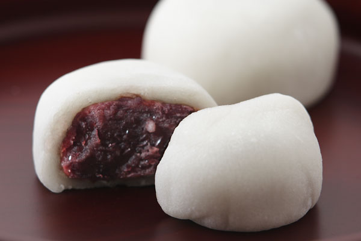
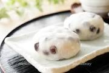
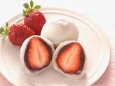

# 私のおすすめの餅

### 大福

***
>何度も食べたくなる豆大福の魅力とはなんでしょうか。豆大福の魅力は、もちとあんと豆の絶妙なバランスです。このバランスが取れていなければおいしいお菓子として成立しません。素朴な見た目と味わいの豆大福ですが、実は奥深い一品になります。

#### 引用元:[餅の魅力](https://www.dango-yamaka.jp/blog/3281/ "")

#### 大福の種類
- 豆大福

- いちご大福

[串団子の紹介](./01index.md)

[餅の簡単な作り方](./02index.md)

