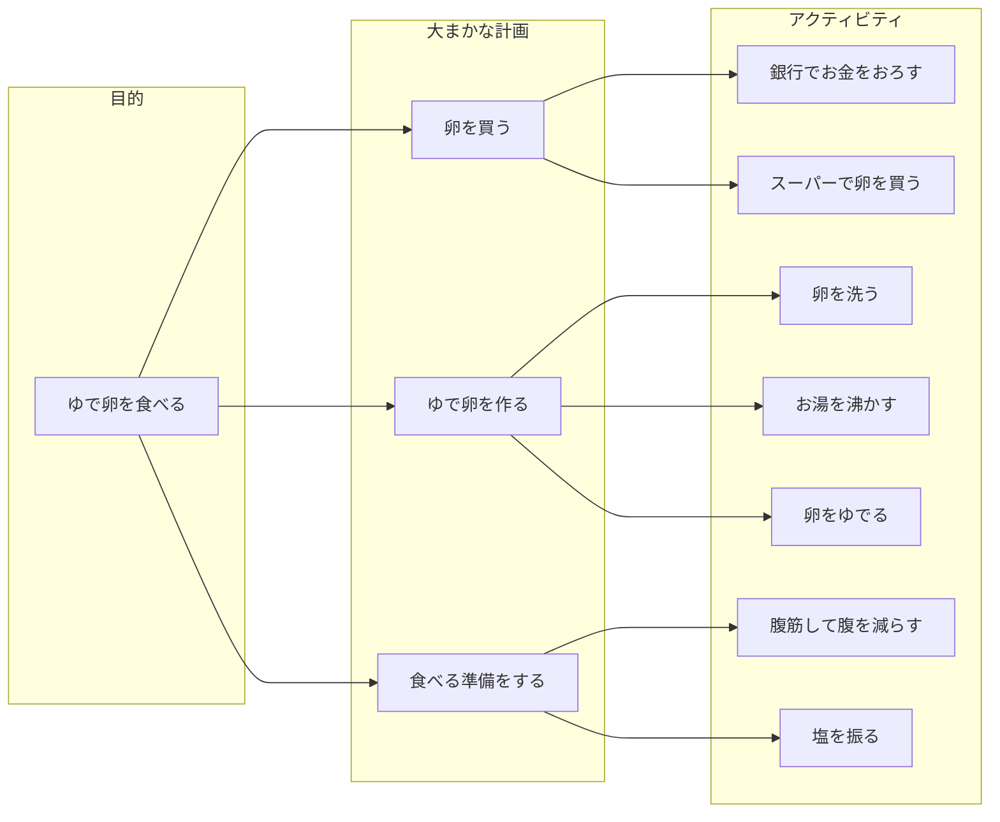

```mermaid

flowchart LR

subgraph 目的

    eat_egg["ゆで卵を食べる"]

end

subgraph 大まかな計画

    bay_eggs["卵を買う"]

    cook_egg["ゆで卵を作る"]

    preparation["食べる準備をする"]

end


subgraph アクティビティ

    bank["銀行でお金をおろす"]

    super["スーパーで卵を買う"]


    wash["卵を洗う"];

    boil["お湯を沸かす"]

    boil_egg["卵をゆでる"]


    motion["腹筋して腹を減らす"]

    wit_salt["塩を振る"]

end


eat_egg--->cook_egg;

eat_egg--->bay_eggs;


eat_egg--->preparation;


bay_eggs--->bank;

bay_eggs--->super;


cook_egg--->wash;

cook_egg--->boil;

cook_egg--->boil_egg;


preparation--->motion;

preparation--->wit_salt;

 

```